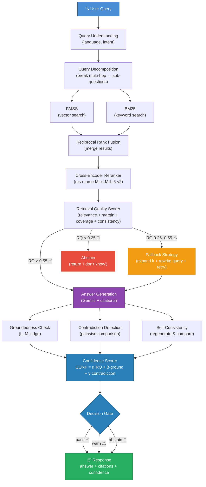
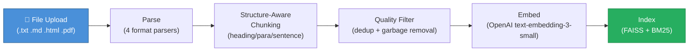
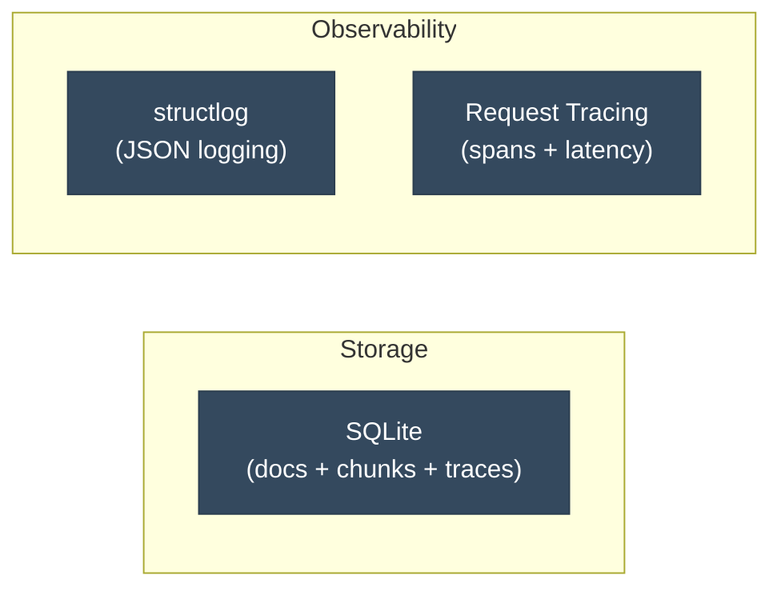

# RAG Reliability Engine

A RAG system that knows when it doesn't know — scores retrieval quality, verifies groundedness, detects contradictions, and abstains when the evidence isn't good enough.

---

## Architecture

### Online: Query Path

How a question goes from user input to a verified, cited answer:



### Offline: Indexing Path



### Storage & Observability



---

## Evaluation Results

75 labeled test cases across 5 categories, run against the live system. Labels are auto-generated from seed documents via Gemini, then **manually verified** for correctness — expected decisions and keywords checked against actual KB content.

### Headline Metrics

| Metric | Value |
|--------|-------|
| **False answer rate** (should-abstain cases answered without caveat) | **11.4%** |
| **Adversarial accuracy** (adversarial decisions correct) | **86.7%** |

### Overall

| Metric | Value |
|--------|-------|
| Decision accuracy | **84.0%** |
| Correct abstain rate (unanswerable → abstain) | **80.0%** |
| False abstain rate (answerable → abstained) | **20.0%** |
| Answer keyword quality | **59.4%** |
| Avg confidence | **0.35** |

### Per-Category Breakdown

| Category | Cases | Decision Accuracy | Avg Confidence | Avg Latency | Abstain Rate |
|----------|------:|------------------:|---------------:|------------:|-------------:|
| factual | 20 | 80.0% | 0.55 | 6,840 ms | 20.0% |
| multi-hop | 10 | 80.0% | 0.54 | 7,873 ms | 20.0% |
| unanswerable | 15 | 86.7% | 0.08 | 9,064 ms | 86.7% |
| adversarial | 15 | 86.7% | 0.18 | 7,231 ms | 66.7% |
| strict-mode | 15 | 86.7% | 0.40 | 6,282 ms | 46.7% |

### Confusion Matrix

| Expected \ Actual | answer | clarify | abstain |
|-------------------|-------:|--------:|--------:|
| **answer** | 30 | 2 | 8 |
| **clarify** | 0 | 0 | 0 |
| **abstain** | 4 | 3 | 28 |

### What the Numbers Mean

**Adversarial accuracy jumped from 46.7% → 80% → 86.7%.** The `or` → `and` bug fix, query-aware groundedness prompt, and self-admitted ignorance detector catch most related-but-uncovered topics. The clarify gate now converts borderline adversarial cases (vector databases, embedding models, prompt engineering) into caveated answers instead of confident false answers. The remaining 2 false answers are cases where the evidence is semantically close enough that the groundedness check can't distinguish (LangChain, facial recognition ethics).

**False answer rate dropped from 53.3% → 20% → 11.4%.** Of the 35 should-abstain cases (adversarial + unanswerable), only 4 still get answered without a caveat. The RQ-aware clarify gate and `warn→clarify` mapping in normal mode convert borderline cases into caveated responses instead of confident answers.

**Factual accuracy improved from 70% → 75% → 80%.** The RQ-aware ignorance detector now returns `clarify` instead of hard-abstaining when evidence quality is high (RQ ≥ 0.55) but the LLM hedges. This recovered cases like factual_10 (RQ=0.925) that were previously false abstains. The remaining 4 false abstains are low-RQ cases where content is split across chunk boundaries.

**Three-state decision space now active.** The `clarify` decision is reachable in both normal and strict modes via two paths: (1) high-RQ ignorance detection routes to clarify instead of abstain, and (2) verification `warn` maps to `clarify` in all modes. The confusion matrix shows 5 clarify decisions — 2 from answerable cases (acceptable) and 3 from should-abstain cases (correctly caveated instead of confidently answered).

### How the Eval Works

| Step | Details |
|------|---------|
| **Label generation** | `scripts/generate_eval_data.py` — Gemini reads seed docs, generates questions + expected keywords per section |
| **Label types** | Expected decision (answer/abstain), acceptable decisions (accounts for LLM non-determinism), expected answer keywords |
| **Leakage prevention** | Generator only sees seed doc text, NOT the system's prompts, thresholds, or internal logic |
| **Runner** | `scripts/run_eval.py` — hits `POST /query` over HTTP (tests full stack including routing + middleware) |
| **Verification** | Keywords checked via case-insensitive substring match against the actual answer text |

---

## What's Working (v1)

- **Hybrid retrieval** — FAISS vector search + BM25 keyword search, fused with Reciprocal Rank Fusion
- **Cross-encoder reranking** — ms-marco-MiniLM-L-6-v2 rescores query-document pairs for better precision
- **Retrieval quality scoring** — weighted composite of relevance, margin, coverage, and consistency
- **Failure-aware decision gate** — proceeds, triggers fallback (expand k + LLM query rewrite), or abstains based on RQ score
- **Answer generation with citations** — Gemini generates answers with numbered source references
- **Groundedness verification** — LLM judge checks if the answer is actually supported by the evidence
- **Contradiction detection** — pairwise document comparison + answer-vs-evidence conflict check
- **Self-consistency check** — regenerates the answer and compares for agreement
- **Confidence scoring** — combines RQ, groundedness, and contradiction rate into a single score
- **Query decomposition** — breaks multi-hop questions into sub-questions via Gemini
- **Structure-aware chunking** — splits by headings, paragraphs, and sentences with configurable overlap
- **Near-duplicate detection** — MinHash LSH catches redundant chunks before indexing
- **Multi-format ingestion** — text, markdown, HTML, and PDF file parsing
- **Normal + strict modes** — strict mode raises all thresholds for conservative operation
- **Full observability** — structured JSON logging, per-request tracing with spans, query trace persistence
- **Evaluation harness** — 75 labeled test cases, 5 categories, auto-generated + manually verified ([tests/](tests/), [eval/](src/rag_engine/evaluation/))
- **39 unit + integration tests** — chunking, RRF, scoring, tokenizer, schemas, storage ([tests/](tests/))

---

## Latency & Cost Profile

Measured on a local machine (no GPU). All LLM calls go to Gemini 2.0 Flash, embeddings to OpenAI text-embedding-3-small.

| Pipeline Stage | Typical Latency | Notes |
|----------------|----------------:|-------|
| Query understanding | ~50 ms | Local (language detection + normalization) |
| Query decomposition | ~1,500 ms | 1 Gemini call |
| Hybrid retrieval (per sub-question) | ~800 ms | 1 OpenAI embedding + FAISS search + BM25 search |
| Cross-encoder reranking | ~200 ms | Local inference (ms-marco-MiniLM-L-6-v2, CPU) |
| RQ scoring + decision gate | ~5 ms | Pure math |
| Fallback (when triggered) | ~3,000 ms | Expand k + Gemini query rewrite + retry retrieval |
| Answer generation | ~1,200 ms | 1 Gemini call |
| Verification (parallel) | ~1,500 ms | 2-3 Gemini calls in parallel (groundedness + contradiction + self-consistency) |
| **Total (normal, no fallback)** | **~5,000 ms** | |
| **Total (with fallback)** | **~8,000 ms** | |
| **Total (strict mode)** | **~4,000-8,000 ms** | Higher thresholds trigger fallback more often |

**Cost per query** (approximate): ~$0.001-0.003 depending on sub-questions and whether fallback triggers. Dominated by Gemini calls (3-6 per query) and one OpenAI embedding call.

---

## Tech Stack

| Component | Choice | Why |
|-----------|--------|-----|
| Framework | FastAPI (async) | Non-blocking I/O for concurrent retrieval + verification |
| LLM | Google Gemini 2.0 Flash | Fast, structured output support |
| Embeddings | OpenAI text-embedding-3-small | 1536-dim, good quality/cost ratio |
| Vector Store | FAISS (CPU) | Battle-tested, zero infrastructure |
| Keyword Search | BM25 (rank_bm25) | Catches exact matches that embeddings miss |
| Reranker | CrossEncoder ms-marco-MiniLM-L-6-v2 | Accurate query-doc pair scoring |
| Storage | SQLite (aiosqlite) | Async, zero-config, single-file persistence |
| Observability | structlog | Structured JSON logs, easy to pipe into any log system |

---

## Quick Start

```bash
# Clone and install
git clone <your-repo-url>
cd rag-reliability-engine
pip install -e ".[dev]"

# Set up environment
cp .env.example .env
# Edit .env with your API keys:
#   RAG_GOOGLE_API_KEY=your-gemini-key
#   RAG_OPENAI_API_KEY=your-openai-key

# Start the server
python -m rag_engine.main
```

Server starts at `http://localhost:8000`.

### Try It Out

```bash
# Check health
curl http://localhost:8000/health

# Ingest a file
curl -X POST http://localhost:8000/ingest \
  -F "file=@your-document.txt" \
  -F 'metadata={"source": "my-doc"}'

# Ask a question
curl -X POST http://localhost:8000/query \
  -H "Content-Type: application/json" \
  -d '{"query": "What does the document say about X?"}'

# Ask in strict mode (higher thresholds)
curl -X POST http://localhost:8000/query \
  -H "Content-Type: application/json" \
  -d '{"query": "What does the document say about X?", "mode": "strict"}'
```

### Run Tests & Evaluation

```bash
# Unit + integration tests
pytest tests/ -v

# Seed sample data
python scripts/seed_data.py

# Generate eval dataset (requires Gemini API key)
python scripts/generate_eval_data.py

# Run eval harness (server must be running)
python scripts/run_eval.py
```

---

## Project Structure

```
src/rag_engine/
├── api/                  # FastAPI routes, middleware, dependency injection
├── chunking/             # Structure-aware splitting + overlap + quality filtering
├── config/               # Pydantic Settings (env-driven) + constants
├── embeddings/           # OpenAI embedder + SQLite cache
├── evaluation/           # Eval harness: metrics, runner, dataset generation
├── generation/           # Gemini provider + prompt templates + answer builder
├── ingestion/            # File parsers (txt/md/html/pdf) + registry + pipeline
├── keyword_search/       # BM25 index + text tokenizer
├── models/               # Domain dataclasses + API schemas
├── observability/        # structlog config + tracing + metrics
├── pipeline/             # Query pipeline (orchestrator) + ingest pipeline
├── protocols/            # typing.Protocol interfaces (7 protocols)
├── query/                # Query understanding + multi-hop decomposition
├── retrieval/            # RRF fusion + hybrid retriever + reranker + fallback
├── scoring/              # Retrieval quality scorer + confidence scorer
├── storage/              # SQLite doc store + trace store + migrations
├── vectorstore/          # FAISS IndexFlatIP wrapper with persistence
└── verification/         # Groundedness + contradiction + self-consistency + decision
```

---

## API

```
POST /query     →  { answer, citations, confidence, decision, reasons, debug }
POST /ingest    →  multipart file + metadata  →  { doc_id, chunks_created, status }
GET  /health    →  { status, docs, chunks, index_size }
```

---

## How the Confidence Score Works

The system produces a confidence score (0-1) combining three signals:

```
CONF = α × RetrievalQuality + β × Groundedness - γ × ContradictionRate
```

Where **RetrievalQuality** itself is:

```
RQ = w1×relevance + w2×margin + w3×coverage + w4×consistency
```

- **Relevance**: How well the top result matches the query (sigmoid-normalized reranker score)
- **Margin**: Gap between the best and second-best result (higher = more decisive)
- **Coverage**: How many unique source documents appear in the results
- **Consistency**: Agreement among top-5 scores (low std = consistent retrieval)

Based on these signals, the system makes a decision:
- **pass** — evidence is solid, answer is grounded
- **warn** — answer provided but with caveats
- **abstain** — evidence too weak, refuses to answer rather than hallucinate

---

## What's Not Done Yet

- **Embedding cache** — schema exists but not wired into the pipeline yet
- **Streaming responses** — answers are returned in full, not streamed
- **Auth/rate limiting** — no API authentication (intended for local/internal use)
- **Docker** — no containerization yet
- **CI/CD** — no automated test pipeline

---

## License

MIT
