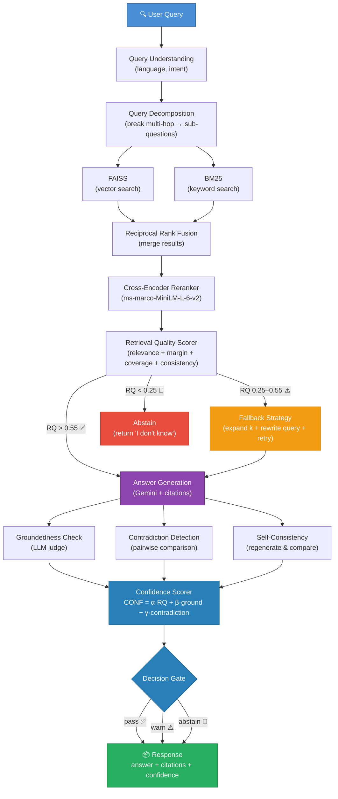
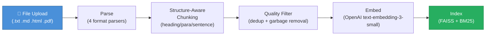

# RAG Reliability Engine

A RAG system that knows when it doesn't know — scores retrieval quality, verifies groundedness, detects contradictions, and abstains when the evidence isn't good enough.

---

## Architecture

### Query Path



### Indexing Path



---

## Quick Start

```bash
git clone <your-repo-url> && cd rag-reliability-engine
pip install -e ".[dev]"
cp .env.example .env   # add your API keys
python -m rag_engine.main
```

Or with Docker:

```bash
docker compose up --build
```

Server starts at `http://localhost:8000`.

### Usage

```bash
# Get a JWT token
TOKEN=$(curl -s -X POST http://localhost:8000/auth/token \
  -H "Content-Type: application/json" \
  -d '{"api_key": "your-api-key"}' | python -c "import sys,json; print(json.load(sys.stdin)['access_token'])")

# Ingest a document
curl -X POST http://localhost:8000/ingest \
  -H "Authorization: Bearer $TOKEN" \
  -F "file=@your-document.txt"

# Query
curl -X POST http://localhost:8000/query \
  -H "Authorization: Bearer $TOKEN" \
  -H "Content-Type: application/json" \
  -d '{"query": "What does the document say about X?"}'

# Stream (SSE)
curl -N -X POST http://localhost:8000/query/stream \
  -H "Authorization: Bearer $TOKEN" \
  -H "Content-Type: application/json" \
  -d '{"query": "What does the document say about X?"}'
```

---

## API

| Endpoint | Auth | Description |
|----------|------|-------------|
| `GET /health` | No | Health check with doc/chunk/index counts |
| `POST /auth/token` | No | Exchange API key for JWT |
| `POST /query` | Yes | Full query response (answer, citations, confidence, decision) |
| `POST /query/stream` | Yes | SSE streaming (`event: token` → `event: metadata` → `event: done`) |
| `POST /ingest` | Yes | Ingest document (multipart file + metadata) |

---

## Evaluation Results

75 labeled test cases across 5 categories, auto-generated via Gemini and manually verified.

| Metric | Value |
|--------|-------|
| Decision accuracy | **84.0%** |
| False answer rate | **11.4%** |
| Adversarial accuracy | **86.7%** |
| Correct abstain rate | **80.0%** |

| Category | Cases | Accuracy | Avg Confidence | Avg Latency |
|----------|------:|--------:|---------------:|------------:|
| factual | 20 | 80.0% | 0.55 | 6,840 ms |
| multi-hop | 10 | 80.0% | 0.54 | 7,873 ms |
| unanswerable | 15 | 86.7% | 0.08 | 9,064 ms |
| adversarial | 15 | 86.7% | 0.18 | 7,231 ms |
| strict-mode | 15 | 86.7% | 0.40 | 6,282 ms |

<details>
<summary>Confusion matrix & analysis</summary>

| Expected \ Actual | answer | clarify | abstain |
|-------------------|-------:|--------:|--------:|
| **answer** | 30 | 2 | 8 |
| **clarify** | 0 | 0 | 0 |
| **abstain** | 4 | 3 | 28 |

- **False answer rate dropped from 53.3% → 11.4%** via RQ-aware clarify gate and ignorance detection
- **Adversarial accuracy improved from 46.7% → 86.7%** through query-aware groundedness and self-admitted ignorance detector
- **Factual accuracy improved from 70% → 80%** by routing high-RQ LLM hedges to clarify instead of hard-abstain
- Three-state decision space (answer/clarify/abstain) is fully active via verification warnings and ignorance detection

</details>

---

## Scoring

```
CONF = α × RQ + β × Groundedness - γ × ContradictionRate
RQ   = w1×relevance + w2×margin + w3×coverage + w4×consistency
```

Three-state decision: **answer** (evidence solid) · **clarify** (answer with caveat) · **abstain** (refuses to hallucinate)

---

## Tech Stack

| Component | Choice |
|-----------|--------|
| Framework | FastAPI (async) |
| LLM | Gemini 2.0 Flash |
| Embeddings | OpenAI text-embedding-3-small (1536-dim, cached in SQLite) |
| Vector Store | FAISS (CPU) |
| Keyword Search | BM25 (rank_bm25) |
| Reranker | ms-marco-MiniLM-L-6-v2 |
| Storage | SQLite (aiosqlite) |
| Auth | JWT (pyjwt) + sliding-window rate limiter |
| Observability | structlog (JSON) + request tracing |
| CI/CD | GitHub Actions (lint, type-check, test, Docker build) |

---

## Project Structure

```
src/rag_engine/
├── api/              # Routes, middleware, auth, rate limiting
├── chunking/         # Structure-aware splitting + quality filtering
├── config/           # Pydantic Settings (env-driven)
├── embeddings/       # OpenAI embedder + SQLite cache wrapper
├── generation/       # Gemini provider + prompt templates + streaming
├── ingestion/        # File parsers (txt/md/html/pdf) + pipeline
├── keyword_search/   # BM25 index + tokenizer
├── models/           # Domain dataclasses + API schemas
├── observability/    # Logging + tracing + metrics
├── pipeline/         # Query pipeline orchestrator
├── protocols/        # typing.Protocol interfaces
├── query/            # Understanding + multi-hop decomposition
├── retrieval/        # RRF + hybrid retriever + reranker + fallback
├── scoring/          # Retrieval quality + confidence scoring
├── storage/          # SQLite doc/trace stores + migrations
├── vectorstore/      # FAISS wrapper with persistence
└── verification/     # Groundedness + contradiction + self-consistency
```

---

## Configuration

All settings via env vars with `RAG_` prefix. See [.env.example](.env.example).

| Variable | Default | Description |
|----------|---------|-------------|
| `RAG_OPENAI_API_KEY` | — | OpenAI API key (embeddings) |
| `RAG_GOOGLE_API_KEY` | — | Google API key (Gemini) |
| `RAG_API_KEYS` | `""` | Comma-separated valid API keys for JWT |
| `RAG_JWT_SECRET` | `change-me-in-production` | JWT signing secret |
| `RAG_RATE_LIMIT_REQUESTS_PER_MINUTE` | `60` | Per-key rate limit |

---

## Future Work

- **Managed vector DB** — swap FAISS for Qdrant/Weaviate/Pinecone for horizontal scaling
- **PostgreSQL** — migrate from SQLite for concurrent write support in production
- **Multi-turn conversation** — session memory for follow-up questions with context carry-over
- **Chunk-level citation highlighting** — return exact spans within chunks, not just chunk IDs
- **OpenTelemetry** — replace custom tracing with OTel for Grafana/Datadog/Jaeger export
- **Prometheus metrics** — latency histograms, cache hit rates, decision distribution counters
- **RBAC** — role-based access control (admin, reader, ingester) beyond flat API keys
- **Incremental re-indexing** — update FAISS/BM25 without full rebuild on document changes
- **Fine-tuned reranker** — train domain-specific cross-encoder on query logs for better relevance
- **Batch query API** — process multiple queries in a single request for evaluation and bulk use
- **Frontend dashboard** — UI for browsing traces, viewing confidence distributions, and testing queries
- **A/B testing framework** — compare prompt templates and threshold configs on eval sets

---

## License

MIT
