# RAG Reliability Engine

A RAG system that knows when it doesn't know.

Most RAG systems happily hallucinate when they can't find good evidence. This one doesn't. It scores retrieval quality, checks if the answer is actually grounded in the sources, detects contradictions between documents, and — when the evidence isn't good enough — it says "I don't know" instead of making things up.

---

## Architecture

### Online: Query Path

How a question goes from user input to a verified, cited answer:

```mermaid
flowchart TD
    Q["🔍 User Query"] --> U["Query Understanding\n(language, intent)"]
    U --> D["Query Decomposition\n(break multi-hop → sub-questions)"]

    D --> F["FAISS\n(vector search)"]
    D --> B["BM25\n(keyword search)"]

    F --> RRF["Reciprocal Rank Fusion\n(merge results)"]
    B --> RRF

    RRF --> RE["Cross-Encoder Reranker\n(ms-marco-MiniLM-L-6-v2)"]
    RE --> RQ["Retrieval Quality Scorer\n(relevance + margin + coverage + consistency)"]

    RQ -->|"RQ > 0.55 ✅"| GEN["Answer Generation\n(Gemini + citations)"]
    RQ -->|"RQ 0.35–0.55 ⚠️"| FB["Fallback Strategy\n(expand k + rewrite query + retry)"]
    RQ -->|"RQ < 0.35 🛑"| ABS["Abstain\n(return 'I don't know')"]

    FB --> GEN

    GEN --> G["Groundedness Check\n(LLM judge)"]
    GEN --> C["Contradiction Detection\n(pairwise comparison)"]
    GEN --> SC["Self-Consistency\n(regenerate & compare)"]

    G --> CONF["Confidence Scorer\nCONF = α·RQ + β·ground − γ·contradiction"]
    C --> CONF
    SC --> CONF

    CONF --> DEC{"Decision Gate"}
    DEC -->|"pass ✅"| OUT["📦 Response\nanswer + citations + confidence"]
    DEC -->|"warn ⚠️"| OUT
    DEC -->|"abstain 🛑"| OUT

    style Q fill:#4A90D9,stroke:#2C5F8A,color:#fff
    style ABS fill:#E74C3C,stroke:#C0392B,color:#fff
    style OUT fill:#27AE60,stroke:#1E8449,color:#fff
    style FB fill:#F39C12,stroke:#D68910,color:#fff
    style GEN fill:#8E44AD,stroke:#6C3483,color:#fff
    style CONF fill:#2980B9,stroke:#1F618D,color:#fff
    style DEC fill:#2980B9,stroke:#1F618D,color:#fff
```



### Offline: Indexing Path

How documents go from raw files to searchable indexes:


### Storage & Observability


---

## What's Working (v1)

Everything below has been built, tested, and verified end-to-end:

- **Hybrid retrieval** — FAISS vector search + BM25 keyword search, fused with Reciprocal Rank Fusion
- **Cross-encoder reranking** — ms-marco-MiniLM-L-6-v2 rescores query-document pairs for better precision
- **Retrieval quality scoring** — weighted composite of relevance, margin, coverage, and consistency
- **Failure-aware decision gate** — proceeds, triggers fallback (expand k + LLM query rewrite), or abstains based on RQ score
- **Answer generation with citations** — Gemini generates answers with numbered source references
- **Groundedness verification** — LLM judge checks if the answer is actually supported by the evidence
- **Contradiction detection** — pairwise document comparison + answer-vs-evidence conflict check
- **Self-consistency check** — regenerates the answer and compares for agreement
- **Confidence scoring** — combines RQ, groundedness, and contradiction rate into a single score
- **Query decomposition** — breaks multi-hop questions into sub-questions via Gemini
- **Structure-aware chunking** — splits by headings, paragraphs, and sentences with configurable overlap
- **Near-duplicate detection** — MinHash LSH catches redundant chunks before indexing
- **Multi-format ingestion** — text, markdown, HTML, and PDF file parsing
- **Normal + strict modes** — strict mode raises all thresholds for conservative operation
- **Full observability** — structured JSON logging, per-request tracing with spans, query trace persistence
- **Evaluation harness** — 75 auto-generated labeled test cases across 5 categories (factual, multi-hop, unanswerable, adversarial, strict-mode) with decision accuracy, abstain rates, answer quality, confusion matrix, and per-category metrics
- **39 tests passing** — unit tests for chunking, RRF, scoring, tokenizer, schemas + integration tests for storage

### Verified in Production Run

| Endpoint | Result |
|----------|--------|
| `GET /health` | `{"status": "ok", "docs": 2, "chunks": 4}` |
| `POST /ingest` (markdown) | 3 chunks created, 85% coverage |
| `POST /ingest` (text) | 1 chunk created, 100% coverage |
| `POST /query` (normal) | Answer with confidence 0.79, RQ 0.875, decision: pass |
| `POST /query` (strict) | Fallback triggered (expanded retrieval + query rewrite), confidence 0.61 |

---

## Tech Stack

| Component | Choice | Why |
|-----------|--------|-----|
| Framework | FastAPI (async) | Non-blocking I/O for concurrent retrieval + verification |
| LLM | Google Gemini 2.0 Flash | Fast, structured output support |
| Embeddings | OpenAI text-embedding-3-small | 1536-dim, good quality/cost ratio |
| Vector Store | FAISS (CPU) | Battle-tested, zero infrastructure |
| Keyword Search | BM25 (rank_bm25) | Catches exact matches that embeddings miss |
| Reranker | CrossEncoder ms-marco-MiniLM-L-6-v2 | Accurate query-doc pair scoring |
| Storage | SQLite (aiosqlite) | Async, zero-config, single-file persistence |
| Observability | structlog | Structured JSON logs, easy to pipe into any log system |

---

## Quick Start

```bash
# Clone and install
git clone <your-repo-url>
cd rag-reliability-engine
pip install -e ".[dev]"

# Set up environment
cp .env.example .env
# Edit .env with your API keys:
#   RAG_GOOGLE_API_KEY=your-gemini-key
#   RAG_OPENAI_API_KEY=your-openai-key

# Start the server
python -m rag_engine.main
```

Server starts at `http://localhost:8000`.

### Try It Out

```bash
# Check health
curl http://localhost:8000/health

# Ingest a file
curl -X POST http://localhost:8000/ingest \
  -F "file=@your-document.txt" \
  -F 'metadata={"source": "my-doc"}'

# Ask a question
curl -X POST http://localhost:8000/query \
  -H "Content-Type: application/json" \
  -d '{"query": "What does the document say about X?"}'

# Ask in strict mode (higher thresholds)
curl -X POST http://localhost:8000/query \
  -H "Content-Type: application/json" \
  -d '{"query": "What does the document say about X?", "mode": "strict"}'
```

### Run Tests

```bash
pytest tests/ -v
```

---

## Project Structure

```
src/rag_engine/
├── api/                  # FastAPI routes, middleware, dependency injection
├── chunking/             # Structure-aware splitting + overlap + quality filtering
├── config/               # Pydantic Settings (env-driven) + constants
├── embeddings/           # OpenAI embedder + SQLite cache
├── generation/           # Gemini provider + prompt templates + answer builder
├── ingestion/            # File parsers (txt/md/html/pdf) + registry + pipeline
├── keyword_search/       # BM25 index + text tokenizer
├── models/               # Domain dataclasses + API schemas
├── observability/        # structlog config + tracing + metrics
├── pipeline/             # Query pipeline (orchestrator) + ingest pipeline
├── protocols/            # typing.Protocol interfaces (7 protocols)
├── query/                # Query understanding + multi-hop decomposition
├── retrieval/            # RRF fusion + hybrid retriever + reranker + fallback
├── scoring/              # Retrieval quality scorer + confidence scorer
├── storage/              # SQLite doc store + trace store + migrations
├── vectorstore/          # FAISS IndexFlatIP wrapper with persistence
└── verification/         # Groundedness + contradiction + self-consistency + decision
```

---

## API

```
POST /query     →  { answer, citations, confidence, decision, reasons, debug }
POST /ingest    →  multipart file + metadata  →  { doc_id, chunks_created, status }
GET  /health    →  { status, docs, chunks, index_size }
```

---

## How the Confidence Score Works

The system produces a confidence score (0-1) combining three signals:

```
CONF = α × RetrievalQuality + β × Groundedness - γ × ContradictionRate
```

Where **RetrievalQuality** itself is:

```
RQ = w1×relevance + w2×margin + w3×coverage + w4×consistency
```

- **Relevance**: How well the top result matches the query (sigmoid-normalized reranker score)
- **Margin**: Gap between the best and second-best result (higher = more decisive)
- **Coverage**: How many unique source documents appear in the results
- **Consistency**: Agreement among top-5 scores (low std = consistent retrieval)

Based on these signals, the system makes a decision:
- **pass** — evidence is solid, answer is grounded
- **warn** — answer provided but with caveats
- **abstain** — evidence too weak, refuses to answer rather than hallucinate

---

## What's Not Done Yet

- **Embedding cache** — schema exists but not wired into the pipeline yet
- **Streaming responses** — answers are returned in full, not streamed
- **Auth/rate limiting** — no API authentication (intended for local/internal use)
- **Docker** — no containerization yet
- **CI/CD** — no automated test pipeline

---

## License

MIT
